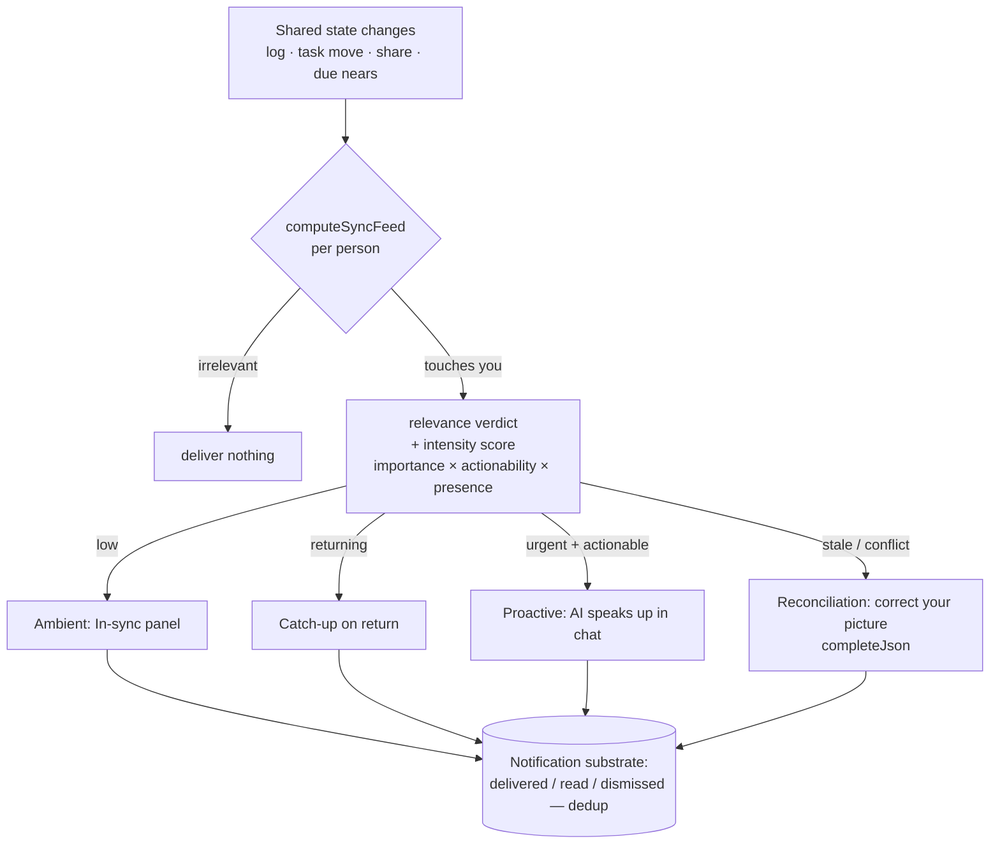

# Active-Sync AI (+ Optional Task Due Dates) - Plan

## Goal Capsule
- **Objective:** Turn Relay's passive notification bell into an **active per-person sync loop** — the AI reaches out and keeps each person's picture of the work correct, at the intensity the moment deserves. Include an **optional, structured task due-date system** that feeds this loop.
- **Product authority:** User (Aaron). Direction settled this session: *"the AI actively syncs information with the user"* — all four delivery shapes wanted, unified into one engine.
- **Open blockers:** None to start. Noise-control (how it stays helpful, not annoying) is the primary design risk to resolve in planning.
- **Scope note:** Two independently-shippable areas live here — the **sync engine** (primary) and the **due-date subsystem** (supporting, can ship first). Due dates are a sync trigger, so they're captured together.

---

## Product Contract

### Problem
Today information reaches people through a **passive notification bell** you must go check, plus a per-visit briefing. Consequences:
- You don't know something changed until you look.
- Notifications are crude (fire by assignee / importance flag) and shallow (one stripped line, no context, no way to act).
- Nothing catches when your *understanding* has gone stale — you can keep building against an old spec and never know.

The bell stores what changed. It does not **make sure you know**.

### Users
Every team member, in their own private workspace. The sync is per-person: the same underlying change is judged and delivered differently for each person it touches (or not delivered to those it doesn't).

### The concept — one relevance engine, graduated delivery
When shared state changes (a log entry, a task moves, knowledge is shared, a deadline shifts or nears), the AI judges the change **for each person**:
- Does it touch their work?
- Does it unblock or block them?
- Does it contradict what they currently believe / are building against?

That single relevance judgment is then delivered at **the intensity the moment deserves**, tuned by **importance × actionability × whether the person is present**:

1. **Ambient — a live "In sync" panel.** A persistent surface the AI keeps continuously true: "here's what changed that touches *your* work," reconciled and re-ranked as things move. Replaces going to check the bell.
2. **On return — a guided catch-up.** When you come back, the AI walks you through "what moved and what it means for you," each item act-on-it.
3. **Proactive — the AI speaks up.** When something is *urgent AND actionable*, Relay initiates in chat ("Sam finished the API — you're unblocked. Start it?").
4. **Reconciliation — it corrects your picture.** The smartest tier: when your understanding is stale or conflicts with new info, it syncs *you* specifically ("you're building against the old spec; the acceptance criteria changed").

These are **not four features** — they are four intensities of the same engine, selected by the relevance judgment.

### Requirements

**Sync engine**
- The AI evaluates each material change in shared state against **each affected person's** current work and understanding, producing a per-person relevance verdict (touches you / unblocks / blocks / contradicts / FYI / irrelevant).
- Each verdict carries an **intensity**: ambient, catch-up, or proactive — derived from importance × actionability × presence. Irrelevant → nothing (the engine must be willing to stay silent).
- **Ambient "In sync" panel** per member: always-current, ranked, reconciled items ("Sam's API done → your task unblocked"; "deadline moved to Fri"; "2 need your reply"). Items resolve/disappear as they're handled or go stale.
- **Return catch-up**: on re-entry after time away, a guided, act-on-it recap of what moved and what it means — an evolution of today's briefing.
- **Proactive speak-up**: for urgent + actionable items, the AI posts a message in the person's chat with inline actions (start / accept / open / reply / dismiss). Rate-limited (see noise control).
- **Reconciliation**: detect when a person's active task is now inconsistent with newer shared info (changed spec, changed dependency, moved deadline) and surface a specific correction with a one-click fix where possible.
- Every surfaced item is **actionable in place** (act / open the linked work / reply / dismiss) — knowing and doing are not two trips.
- **Attribution + context**: each item names who/what caused it and links the underlying task/record/knowledge.

**Noise control (primary design constraint — a requirement, not a nicety)**
- The engine must be **willing to deliver nothing**; silence is a valid, common output.
- Proactive interruptions are reserved for urgent + actionable; everything else waits in ambient/catch-up.
- Per-person controls to tune what escalates (at minimum: mute a stream, or drop proactive down to ambient). Exact controls: planning.
- No duplicate nagging: an item delivered ambiently and acted on never also interrupts.

**Optional task due dates (supporting subsystem)**
- A task **may** carry a due date; assigning one is **always optional** (unset is a first-class, common state — no default, no pressure).
- Due dates are **structured** (a real date), not the current free-text `Task.due` string — set via a date picker in the task spec / draft editor.
- Derived states surfaced consistently: **due soon**, **due today**, **overdue** (and "no due date" shown as neutral, never as a warning).
- Due dates **feed the sync engine**: approaching/overdue on *your* task → ambient or proactive per urgency; a deadline change by someone else on your task → a sync item.
- Sorting/filtering by due where tasks are listed (board, "your open work"). Exact surfaces: planning.
- Migration note: the existing free-text `due` values must be preserved or sensibly migrated (planning owns the how).

### Acceptance examples (representative)
- Sam marks the API task done → Alex (owner of a task that depended on it) sees an ambient "you're unblocked" item **and**, because it's actionable, Relay speaks up in Alex's chat offering to start it; Jordan (unrelated) sees nothing.
- Jordan edits a task's acceptance criteria that Alex is actively working → Alex gets a reconciliation item: "you're on the old spec," with a one-click "update my task."
- A task Alex owns crosses into **overdue** → it shows as overdue on the board and appears in Alex's In-sync panel; if also blocking others, it escalates.
- A teammate sets no due date on a task → it reads as neutral "no date," never nags, and is excluded from due-based sorting/warnings.
- Alex returns after a day → a catch-up lists the 3 things that moved and what each means, each with an action; acting on one clears it everywhere.

### Non-goals (for this work)
- Not replacing the Log or chat; this is about *reaching* people, not new capture.
- Not real-time multi-user presence/websockets infrastructure as a hard requirement (ambient panel can refresh on activity/poll; live transport is a planning choice, not a product requirement).
- Not calendar integration, recurring due dates, reminders-by-email, or time-of-day due times in v1.
- Not team-wide analytics/dashboards.

### Key decisions
- **session-settled:** The direction is *the AI actively syncs information with each user* — proactive, not a passive bell.
- **session-settled:** All four shapes are wanted, unified as **one relevance engine at four intensities** (ambient / catch-up / proactive / reconciliation), tuned by importance × actionability × presence.
- **session-settled:** Assigning a task due date is **optional**; unset is first-class.
- **session-settled:** This work is **captured now, built after the demo** (no code changes today).
- Build on existing pieces rather than net-new: notifications/`applyActions` (change events), briefings + `lastSeenAt` (what's-new + presence), the agent's reasoning (relevance). The bell grows a brain; it isn't ripped out.

### Outstanding questions (for planning)
- Relevance judgment: rule-based, AI-judged per change, or hybrid? (Cost/latency vs. quality — the reconciliation tier likely needs the AI.)
- What exactly defines "present" for presence-tuning (active tab, recent activity, `lastSeenAt` window)?
- Delivery transport for the ambient panel: poll vs. push; acceptable staleness.
- Escalation controls surface + defaults (how much a user can tune before it's built).
- Due-date migration: convert/parse existing free-text `due` values, or start fresh.
- Where the "In sync" panel lives spatially (its own rail region, top of chat, a dedicated surface) — a visual decision to probe in planning/design.

### How this work fits together
Relay's thesis is "chat is for people, work runs on Relay." This makes the *"work runs on Relay"* half active: the workspace doesn't just hold the shared picture, it **pushes it to the people who need it, correctly**. It sits directly on top of the just-built **Workstreams** (relevance is naturally stream-aware) and evolves the existing **notifications + briefings** rather than competing with them. Due dates are the first concrete, high-signal trigger that makes the engine's value obvious.

### Suggested phasing (for planning to refine)
1. **Due-date subsystem** (small, independently valuable, unblocks a clean trigger): structured optional due date + picker + soon/today/overdue states + sort.
2. **Ambient "In sync" panel** built from the existing briefing computation, made continuous and relevance-ranked.
3. **Proactive speak-up** on urgent+actionable items, with noise control.
4. **Reconciliation tier** (stale/conflict detection) — the differentiator, built last on top of the engine.

---

## Planning Contract

**Product Contract preservation:** unchanged (WHAT above is untouched; this section adds HOW).

**Grounding:** planned against the live codebase (edited throughout this session). Key existing seams this builds on:
- `src/app/api/briefing/route.ts` — already computes "what's new since `lastSeenAt`" (your open tasks, others' updates, new knowledge, pending change requests) and stamps `lastSeenAt`. This is the seed of the relevance feed.
- `src/lib/state.ts` `applyActions()` — already fires `Notification` rows on assignment and important shares; the place to also emit sync signals.
- `Notification` model (`prisma/schema.prisma`) — has `kind`, `importance`, `read`, `fromName`, `boardName`, `taskName`. Reused as the substrate for delivered/dedup state (add kinds) rather than a new table.
- `Task.due String?` — already exists; today it's free-text and unused. Becomes a structured optional ISO date.
- `src/lib/minimax.ts` `completeJson<T>()` — used for the AI-judged reconciliation tier only.
- `src/components/RelayApp.tsx` — `BriefingCard`, the notifications bell/panel, `TasksEditor`/`TaskDetail`, the Kanban, and the new Workstream rail are the client seams.

### Key Technical Decisions
- **KTD1 — Due stays `Task.due String?`, stored as ISO `YYYY-MM-DD`.** No schema change for dates; keep it optional (unset is first-class). All soon/today/overdue logic lives in one shared helper. *(session-settled: user-directed — due dates optional, chosen over a required/defaulted date.)*
- **KTD2 — The sync feed is computed, not a new heavy table.** `computeSyncFeed(memberId, now)` reads existing tasks/updates/knowledge/`lastSeenAt` and returns ranked items. Delivered/dismissed/dedup state rides on the existing `Notification` model with new `kind`s (`unblock`, `deadline`, `reconcile`), so we don't re-nag.
- **KTD3 — Relevance is rule-based for cheap tiers, AI-judged only for reconciliation.** Unblock/deadline/assignment verdicts are deterministic; the reconciliation tier (stale-spec detection phrasing + fix) uses `completeJson`. Controls cost/latency.
- **KTD4 — Ambient panel polls; no realtime transport.** Matches the non-goal. The panel refetches on activity and on a light interval.
- **KTD5 — Proactive "speak-up" = an injected assistant `Message` in the member's active-stream chat + a `Notification`, gated by urgent AND actionable, rate-limited, and deduped against already-delivered notifications.**

### High-Level Technical Design — one engine, graduated delivery

---

## Implementation Units

### Phase 1 — Due dates (independently shippable)

### U1. Structured optional due date + picker
- **Goal:** Turn `Task.due` from free text into a real, optional date set via a picker, with derived states.
- **Requirements:** due-date subsystem (optional, structured, soon/today/overdue).
- **Dependencies:** none.
- **Files:** `src/lib/dates.ts` (new — `parseDue`, `formatDue`, `dueState(due, now): "none"|"soon"|"today"|"overdue"`), `src/lib/dates.test.ts` (new), `src/components/RelayApp.tsx` (`TasksEditor` ~line 1710: add `<input type="date">`; `TaskDetail` ~line 1924/1992: editable due), `src/lib/types.ts` (add `DueState`).
- **Approach:** Store ISO `YYYY-MM-DD` in the existing `due String?`. "Soon" = within 3 days (a named constant). Never coerce empty → a date; blank stays blank.
- **Patterns to follow:** existing `d-input` fields in `TasksEditor`; `parseList` tolerance style in `state.ts`.
- **Test scenarios:**
  - `dueState` returns `overdue` for yesterday, `today` for today, `soon` for +2 days, `none` for `null`/`""`.
  - Boundary: exactly +3 days → `soon`; +4 → not soon.
  - Setting then clearing the picker persists `null`, not `""`-as-date.

### U2. Surface due on cards, "your open work", and sort
- **Goal:** Show due state consistently; sort open work by urgency; overdue reads as a warning, no-date reads neutral.
- **Requirements:** consistent surfacing; sorting by due.
- **Dependencies:** U1.
- **Files:** `src/components/RelayApp.tsx` (`TaskCard` due chip; `myTasks` sort), `src/app/globals.css` (`.due-chip` + `.overdue/.today/.soon`).
- **Approach:** Chip uses `dueState`; overdue uses `--bad`, today `--warn`, soon `--muted`, none omitted. Sort: overdue → today → soon → dated → undated.
- **Test scenarios:** `Test expectation: none` (presentational) — but if the sort comparator is extracted to `dates.ts`, unit-test the ordering above.

### U3. Due-driven sync signals
- **Goal:** Approaching/overdue on your task, and a teammate changing your task's due, become sync inputs.
- **Requirements:** due dates feed the sync engine.
- **Dependencies:** U1; feeds U4.
- **Files:** `src/lib/sync.ts` (new — `dueSignals(memberId, now)`), `src/lib/sync.test.ts` (new).
- **Approach:** Query the member's not-done tasks with a due; emit a signal for overdue/today/soon. Deadline-change detection deferred to U4's event pass.
- **Test scenarios:** overdue own task → one `deadline` signal; no-due task → none; someone else's overdue task → none for this member.

### Phase 2 — Ambient sync feed

### U4. Relevance engine (`computeSyncFeed`)
- **Goal:** One function that turns shared state into a per-person ranked feed with verdict + intensity.
- **Requirements:** per-person relevance; intensities; willing to return empty.
- **Dependencies:** U3.
- **Files:** `src/lib/sync.ts`, `src/lib/sync.test.ts`, `src/lib/types.ts` (`SyncItem`, `SyncVerdict`, `SyncIntensity`).
- **Approach:** Reuse the briefing queries (`src/app/api/briefing/route.ts`). Verdicts (rule-based): `unblocked` (a dependency task went done), `blocked`, `deadline` (from U3), `assigned`, `fyi` (others' updates/shares touching your stream), else excluded. Intensity = importance × actionability × presence (`lastSeenAt`). Dedup against delivered `Notification` rows.
- **Patterns to follow:** the `Promise.all` multi-query shape in the briefing route; `normalizeStatus`/`parseList` tolerance.
- **Test scenarios:**
  - Sam completes a task Alex's task depends on → Alex gets one `unblocked` item; unrelated Jordan gets none.
  - An FYI share on Alex's stream → `fyi` at ambient intensity.
  - Irrelevant change → feed excludes it (empty allowed).
  - An item already delivered (notification exists) is not re-emitted.

### U5. `/api/sync` route
- **Goal:** Serve the feed; accept act/dismiss.
- **Dependencies:** U4.
- **Files:** `src/app/api/sync/route.ts` (new — GET `?memberId&boardId`; POST `{ itemId, action: "dismiss"|"act" }`).
- **Approach:** Mirror `src/app/api/notifications/route.ts` shape. Dismiss marks the backing notification read/dismissed.
- **Test scenarios:** GET returns ranked items; POST dismiss hides it on next GET; unknown member → empty, 200.

### U6. "In sync" ambient panel (client)
- **Goal:** An always-current surface showing ranked items, act-on-it inline.
- **Dependencies:** U5.
- **Files:** `src/components/RelayApp.tsx` (`SyncPanel`), `src/app/globals.css`.
- **Approach:** Lives at the top of the active stream (above chat) or a rail region; polls `/api/sync` on load, on activity, and on a light interval. Each item: verdict icon, text, act button (start/open/reply/dismiss). Empty state is calm, not a zero-badge.
- **Test scenarios:** `Test expectation: none` (UI) — verified in the E2E pass.

### Phase 3 — Return catch-up + proactive

### U7. Return catch-up
- **Goal:** On return after time away, a guided, act-on-it recap fed by the same engine.
- **Dependencies:** U4.
- **Files:** `src/components/RelayApp.tsx` (`BriefingCard` → catch-up), `src/app/api/briefing/route.ts` (delegate to `computeSyncFeed`).
- **Approach:** Replace the ad-hoc briefing lists with the ranked feed filtered to "since `lastSeenAt`"; keep the `lastSeenAt` stamp.
- **Test scenarios:** after a gap with 3 relevant changes → 3 catch-up items; acting on one clears it from the feed.

### U8. Proactive speak-up
- **Goal:** For urgent+actionable items, Relay initiates in chat, rate-limited and deduped.
- **Dependencies:** U4, U6.
- **Files:** `src/lib/sync.ts` (`proactiveFor(memberId)`), chat/state load path (`src/app/api/state/route.ts` or `/api/sync`), `src/components/RelayApp.tsx` (render injected assistant message).
- **Approach:** On load / after an event, pick the top urgent+actionable undelivered item; inject an assistant `Message` in the active stream + a `Notification`; mark delivered so it never repeats. Cap N proactive/session.
- **Test scenarios:** unblock event → one proactive message with a start action; a second load does not repeat it; a non-actionable change never speaks up.

### U9. Noise control
- **Goal:** Silence when empty, no re-nag, per-stream mute.
- **Requirements:** noise control (hard requirement).
- **Dependencies:** U4–U8.
- **Files:** `src/lib/sync.ts` (dedup + mute filter), `src/components/RelayApp.tsx` (mute toggle on a stream), a client pref (localStorage) or `Member`-scoped mute set.
- **Approach:** Delivered items never re-surface (notification dedup); an item acted on ambiently never also interrupts; muted streams drop proactive to ambient.
- **Test scenarios:** muted stream → no proactive, still visible in panel; item acted-on in panel → no later chat interruption.

### Phase 4 — Reconciliation (the differentiator)

### U10. Reconciliation tier
- **Goal:** Detect when your in-progress task is now inconsistent with newer shared info and offer a one-click fix.
- **Requirements:** reconciliation ("you're on the old spec").
- **Dependencies:** U4.
- **Files:** `src/lib/sync.ts` (`reconcileFor`), `src/lib/prompts.ts` (a reconcile prompt), `src/lib/minimax.ts` (`completeJson`), `src/components/RelayApp.tsx` (reconcile item with a "fix" button → `/api/publish` or `/api/apply`).
- **Approach:** Flag a member's `inprogress` task whose acceptance criteria/objective/dependency/due changed after they started it (compare `updatedAt` vs. the member's engagement). `completeJson` phrases the correction and proposes an `update_task` action; the fix goes through the existing execute/publish path.
- **Test scenarios:**
  - Jordan edits Alex's in-progress task's criteria → Alex gets a `reconcile` item with a fix; applying it updates the task.
  - No change since engagement → no reconcile item (no false positive).
  - `completeJson` returns null (AI down) → degrade to a plain "this task changed" item, no crash.

---

## Verification Contract
- `npx tsc --noEmit` clean; page HTTP 200; `/api/ai-health` ok.
- Unit: `dates.test.ts` (state boundaries) and `sync.test.ts` (verdicts, dedup, empty-allowed, reconcile true/false-positive) pass.
- E2E (drive via API + UI): set a due date → overdue chip on the card and a `deadline` item in the panel; Sam completes a dependency → Alex sees an `unblocked` ambient item AND one proactive chat message (not repeated on reload); Jordan edits Alex's in-progress criteria → a reconcile item whose fix updates the task; an unrelated member sees nothing; mute a stream → proactive suppressed.
- Noise: with no relevant changes, the panel is calmly empty and no proactive fires.

## Definition of Done
- Due dates are optional, structured, and show soon/today/overdue consistently; no-date is neutral.
- One relevance engine produces a per-person feed at four intensities and is willing to stay silent.
- Ambient panel is live; return catch-up is guided; proactive is gated, rate-limited, and deduped; reconciliation catches stale specs with a one-click fix.
- All tiers run off real data via `/api/sync`; delivered/dismissed state prevents re-nagging.
- `tsc` clean, page 200, no runtime errors on an empty workspace.
