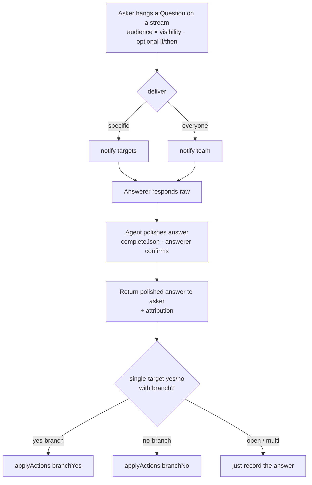

# Questions on the Board (AI-Brokered Q&A) - Plan

## Goal Capsule
- **Objective:** Let anyone **hang a question on a workstream** to get a specific answer from specific people — with optional **answer-triggered actions**, **AI mediation** of the answer, and **flexible audience/visibility**. Turns "asking someone a detail" from a lost chat line into a tracked, actionable object.
- **Product authority:** User (Aaron). Direction settled this session.
- **Open blockers:** None to start. The multi-answerer resolution rule (below) is the main product fork to settle in planning.
- **Relationship:** Sibling to the **Active-Sync AI** plan (`2026-08-02-001`). Sync *pushes* what changed; this *pulls* a needed answer. A hung question is **delivered by the sync engine**, executes via the existing **board-action** system, and reuses the agent's **coaching/mediation** pattern.

---

## Product Contract

### Problem
Asking a teammate for a specific detail has no home. It's a chat message that scrolls away: no structure, no tracking of whether it was answered, no follow-through when it is, and no control over who's asked vs. who can see it. The asker then has to remember to chase it and manually do the thing the answer unblocks.

### Users
- **Asker** — needs a specific detail to move forward, and often already knows what they'll do with each answer.
- **Answerer(s)** — the specific person/people (or everyone) who can answer.
- Bystanders — teammates who may or may not be allowed to see the question, by the asker's choice.

### The concept — a Question is a first-class object
You **hang a question on a workstream**. It carries: the ask, an **audience + visibility** choice, **optional answer-conditioned actions**, and an **AI-brokered answer**. It's tracked (open → answered → resolved) and lives with the work it's about.

### Requirements

**Asking**
- Create a question on a workstream; it becomes a tracked object with a clear open/answered/resolved state.
- **Audience × visibility model** (the asker picks one):
  1. **Ask specific people — private:** only the asked can see it. (a quiet side-question)
  2. **Ask specific people — visible:** the asked are pinged; the rest of the team can see it too. (transparent but directed)
  3. **Ask everyone:** broadcast to the workstream/team.
- **Optional answer-conditioned actions:** the asker may attach follow-through per answer — e.g. *"if yes → mark 'ship' in progress; if no → create task 'revisit spec'."* The "do X" reuses existing **board actions** (create/complete/update task, share knowledge, notify). Actions are **optional** — a question can simply gather an answer.

**Answering (AI-brokered)**
- Asked people are **actively reached** (via the sync engine / notification), not left to notice.
- When an answerer responds, the agent **works with them to polish the answer** — clarify, complete, tighten — the same coaching pattern used elsewhere, applied to answers. The answerer confirms the polished version.
- The polished answer is **returned to the asker**, attributed, attached to the question.
- If the question had answer-conditioned actions, the matching branch **executes automatically** on answer, and the asker is told what fired.

**Tracking & delivery**
- Open questions are visible to exactly those the visibility choice allows; answered questions show the polished answer + which actions fired.
- Questions integrate with the sync engine as first-class sync items ("Sam answered your question"; "you have 1 unanswered question").

### Acceptance examples (representative)
- Alex hangs *"Is the sensor spec final?"* on the Robotics stream, asks **Jordan privately**, and attaches *yes → mark 'mount sensor' ready; no → create 'finalize spec'*. Jordan is pinged, answers "not yet, changing the mount," the agent polishes it into a clear answer, returns it to Alex, and auto-creates "finalize spec." Nobody else saw the exchange.
- Alex asks **everyone** *"Anyone have the old firmware hash?"* (visible, no branch). Answers come back polished and attributed; the asker picks the useful one.
- Alex asks **Sam, visible to the team** — teammates can see the question and the eventual answer, so the detail becomes shared knowledge, not a private DM.

### Non-goals (for this work)
- Not a threaded discussion forum or general chat replacement.
- Not anonymous polling or analytics dashboards (simple answer collection only).
- Not required approvals/routing chains (that's ChangeRequests' job).

### Key decisions
- **session-settled:** Questions are **hung on a workstream** as tracked objects (not ephemeral chat).
- **session-settled:** Three audience/visibility modes — ask-specific-private, ask-specific-visible, ask-everyone.
- **session-settled:** Answers can carry **optional conditional actions** ("if yes/no → do X"), executed via existing board actions.
- **session-settled:** The agent **mediates the answer** with the answerer (polishes it) before returning it to the asker.
- Reuse over net-new: board actions for branching, the coaching pattern for polishing, the sync engine for delivery, Workstreams for scoping.

### Outstanding questions (for planning)
- **Multi-answerer resolution (biggest fork):** when specific-multiple or everyone can answer, and the question has yes/no branching — does the **first** answer trigger the branch, does each answer stand alone (no branch), or does the **asker choose** which answer counts? Branching fits a single designated answerer most cleanly; broadcast leans "gather, asker decides." Likely: branching only offered when exactly one person is asked.
- **Answer types:** yes/no (branchable) vs open-ended (polished text, no branch) — support both; branches require a structured (yes/no or choice) answer.
- **Where a question lives visually:** a card on the Kanban, a dedicated "Questions" lane on the workstream, or a distinct surface. (A visual decision — probe in planning/design.)
- Can an answerer **decline or reassign** ("ask Jordan instead")?
- Can visibility change after asking? Who can see the answer vs. the question?
- Does asking-everyone need a "first good answer closes it" vs. staying open for more?

### How this work fits together
It completes the information-flow picture: **Active-Sync** pushes what changed, **Questions** pulls what's missing — both AI-brokered, both delivered by the same sync engine, both workstream-scoped. It reuses three things already in the codebase (board actions, the agent's coaching/mediation, notifications), so it's an extension of Relay's grain, not a new subsystem.

### Suggested phasing (for planning to refine)
1. **Question object + the three audience/visibility modes**, delivered via existing notifications/sync — ask and get a plain answer, tracked.
2. **AI answer mediation** (polish-with-answerer, return to asker).
3. **Answer-conditioned actions** (the "if yes/no → do X" branching, on single-answerer questions).

---

## Planning Contract

**Product Contract preservation:** unchanged. One product decision from the brainstorm's Outstanding Questions is resolved here and recorded as KTD2: **branching is offered only when exactly one person is asked** (the brainstorm's stated default) — this is a planning resolution, not a scope change.

**Grounding:** planned against the live codebase. Existing seams reused:
- `BoardAction` union (`src/lib/types.ts:73`) + `applyActions()` (`src/lib/state.ts`) — the executor for answer-conditioned actions. No new action machinery.
- The agent's coaching pattern (`ask_questions` / `completeJson` in `src/lib/minimax.ts`) — reused to polish an answer with the answerer.
- `Notification` model — delivery substrate (new kind `question`), plus the Active-Sync feed (plan 001) once it lands.
- Workstreams (`Board`) — questions are board-scoped, like tasks.
- `src/components/RelayApp.tsx` draft-window + modal patterns — the ask composer and answer flow.

### Key Technical Decisions
- **KTD1 — New `Question` model (additive migration).** Fields: `projectId`, `boardId`, `askerId`, `text`, `audience` (`specific`|`everyone`), `visibility` (`private`|`team`), `targetIds` (JSON string[]), `answerType` (`open`|`yesno`), `branchYes`/`branchNo` (JSON `BoardAction[]`), `status` (`open`|`answered`|`resolved`), `answerRaw`, `answer` (polished), `answererId`, `createdAt`. `db push --skip-generate` then `generate` (matches the project's additive workflow). *(session-settled: hung on a workstream as a tracked object.)*
- **KTD2 — Branching only when `audience = specific` AND exactly one target.** Ask-everyone / multi-target questions gather answers with no branch. Resolves the brainstorm's biggest open fork. *(session-settled: user-directed — chosen over first-answer-wins and asker-picks, per the brainstorm default.)*
- **KTD3 — Answer mediation reuses the agent.** The answerer's raw answer is polished by `completeJson` (clarify/complete/tighten), the answerer confirms, then it's returned to the asker. Same honesty rules as the rest of the agent.
- **KTD4 — Visibility is enforced server-side on every read.** `private` → only asker + targets; `team` → whole team. Never client-gated.
- **KTD5 — Delivery reuses `Notification` (+ the sync feed).** Asking notifies targets (or everyone); answering notifies the asker. No bespoke delivery.

### High-Level Technical Design — ask → deliver → mediate → branch

---

## Implementation Units

### U1. Question model + create endpoint
- **Goal:** Persist a Question hung on a workstream with the three audience/visibility modes.
- **Requirements:** ask on a board; audience × visibility model.
- **Dependencies:** none.
- **Files:** `prisma/schema.prisma` (Question model + `Project.questions`/`Board` relation), `src/lib/types.ts` (`QuestionDTO`, enums), `src/app/api/question/route.ts` (new — POST create), `prisma/seed.ts` (wipe questions in reseed).
- **Approach:** Validate audience/visibility; `everyone` ignores `targetIds`. Store branch actions as JSON only when single-target yes/no (KTD2), else null. Additive `db push` + `generate`.
- **Patterns to follow:** `src/app/api/board/route.ts` create shape; `parseList` for JSON columns.
- **Test scenarios:**
  - Create specific-private with one target → stored with `visibility=private`, `targetIds=[id]`.
  - Create ask-everyone → `audience=everyone`, `targetIds` empty, `visibility=team`.
  - Branch actions accepted only for single-target yes/no; rejected/nulled otherwise.

### U2. Read + visibility enforcement
- **Goal:** List questions for a member, enforcing visibility server-side.
- **Requirements:** visibility (private hidden from non-targets; team visible).
- **Dependencies:** U1.
- **Files:** `src/app/api/question/route.ts` (GET `?memberId&boardId`), `src/lib/state.ts` (optional: include open-question counts per board for the rail).
- **Approach:** Return questions where the member is asker or target, plus `team`-visible ones. Never rely on the client to hide.
- **Test scenarios:**
  - Private question is absent for a non-target member; present for a target.
  - Team-visible question present for everyone on the stream.
  - Answered question shows the polished answer + which actions fired.

### U3. Delivery on ask
- **Goal:** Pinged people are actively reached.
- **Requirements:** targets reached (not left to notice).
- **Dependencies:** U1.
- **Files:** `src/app/api/question/route.ts` (create path), `src/lib/state.ts` (notification helper), reuse `Notification`.
- **Approach:** On create, `Notification{kind:"question"}` to each target (or all others for everyone). Integrates with the Active-Sync feed (plan 001) when present.
- **Test scenarios:** specific → only targets notified; everyone → all-but-asker notified; asker never notified of own question.

### U4. Answer + AI mediation
- **Goal:** Answerer responds; the agent polishes; the polished answer returns to the asker.
- **Requirements:** AI-brokered answer; return to asker with attribution.
- **Dependencies:** U1–U3.
- **Files:** `src/app/api/question/answer/route.ts` (new), `src/lib/prompts.ts` (answer-polish prompt), `src/lib/minimax.ts` (`completeJson`), `src/lib/state.ts` (notify asker).
- **Approach:** Store `answerRaw`; `completeJson` returns a polished answer; answerer confirms (client) → persist `answer`, `answererId`, `status=answered`; notify asker. AI-down → fall back to the raw answer, flagged unpolished.
- **Test scenarios:**
  - Raw answer gets polished and attributed to the answerer; asker notified.
  - AI unavailable → raw answer stored, no crash, marked unpolished.
  - Non-target cannot answer a private question (403).

### U5. Answer-conditioned actions (branching)
- **Goal:** On a single-target yes/no question, the matching branch executes on answer.
- **Requirements:** optional if-yes/if-no actions via board actions.
- **Dependencies:** U1, U4.
- **Files:** `src/app/api/question/answer/route.ts` (invoke `applyActions`), `src/lib/state.ts`.
- **Approach:** On answer, if `answerType=yesno` and a branch exists, run `applyActions(branchYes|branchNo)` on the question's board; record what fired; tell the asker. Open/multi → no branch.
- **Test scenarios:**
  - "yes" → `branchYes` actions applied (e.g., task marked ready); "no" → `branchNo` applied.
  - Open-ended answer with no branch → nothing fires, answer still returned.
  - Branch actions scoped to the question's board, not the active one.

### U6. UI — ask composer, questions surface, answer flow
- **Goal:** Hang a question, see it on the workstream, answer it, read answered ones.
- **Requirements:** the end-to-end product surface.
- **Dependencies:** U1–U5.
- **Files:** `src/components/RelayApp.tsx` (ask composer with audience/visibility/branch; a "Questions" area on the stream; answer flow with the polish step; answered display), `src/app/globals.css`.
- **Approach:** Reuse the draft-window/modal patterns. Audience/visibility as segmented controls; branch editor (reusing the tasks/board-action draft UI) appears only for single-target yes/no. Answering shows the AI-polished version before send.
- **Test scenarios:** `Test expectation: none` (UI) — verified via the E2E pass and the API tests above.

---

## Verification Contract
- `npx tsc --noEmit` clean; `db push` + `generate` succeed; page HTTP 200.
- API E2E: create in each of the three modes; a private question is invisible to a non-target (GET) and un-answerable by them (403); an answer is polished, attributed, and returned to the asker; a single-target yes/no branch fires `applyActions` on "yes" and the other set on "no"; ask-everyone gathers answers with no branch.
- Reseed wipes questions; empty workspace has no questions and does not error.

## Definition of Done
- A Question is a tracked object hung on a workstream (open → answered → resolved).
- All three audience/visibility modes work and visibility is enforced server-side.
- Optional branching runs via existing board actions, offered only for single-target yes/no.
- Answers are AI-polished with the answerer and returned, attributed, to the asker; AI-down degrades gracefully.
- Delivered via notifications (and the sync feed when present); `tsc` clean, page 200.
